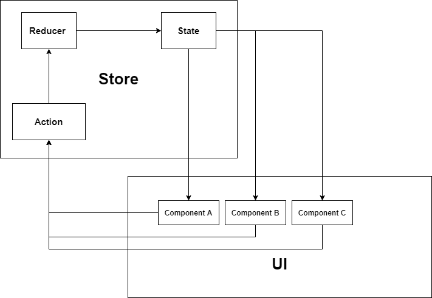
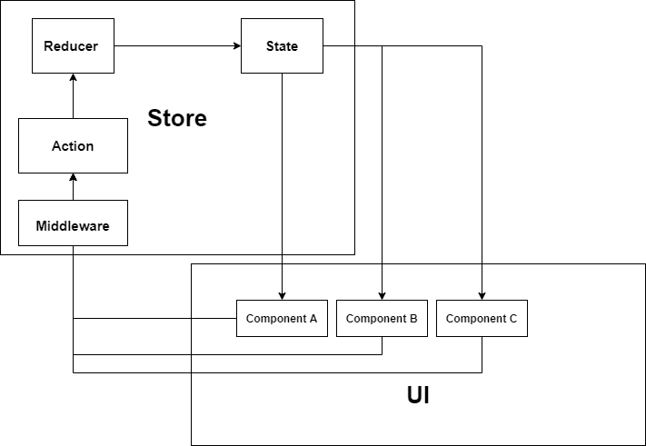

# 深入理解 redux，从零实现一个 redux

初识 Redux，官方文档直接把我看蒙了。太复杂了，这讲的是工具还是哲学？

但是 Redux 作为一个状态管理容器，起到的作用就是维护状态 State，在这基础上做一些限制。

比如 状态 State 只读，要想修改状态必须要通过某个 Action 触发，这个行为由纯函数 Reducer 执行。
这基本就是 Redux 全部思想了。

## 目录

- 介绍
- 简单的 Redux
- 多 State 多 Reducer
- 原则和规范
- 中间件机制
- 其他
- 总结

## 介绍

**为什么需要 Redux 或者说 为什么需要状态管理器？**

### 单一数据源，State 只读

这个和我们为什么用全局变量和少用全局变量是一个道理。  
用全局变量的好处，方便维护，统一管理。 但是要少用，避免污染。

- 避免污染，State 只读属性，只暴露单一接口修改，这个和全局变量差不多，

  - 反例： 如果 A 组件修改了 State,B 组件也修改了 State，但是 AB 在不同条件下触发修改 State，执行的先后顺序不同，那最终结果是 A 修改的值还是 B 修改的值？这也是 [竞太条件](https://zh.wikipedia.org/wiki/%E7%AB%B6%E7%88%AD%E5%8D%B1%E5%AE%B3)

- 便于跟踪和维护，State 只能通过 Action 触发修改，我们可以很清楚的得知并控制触发来源。而且我们可以围绕 acton 更快捷增加修改日志记录等。

所以这么看来，Redux 要解决的问题，就是把状态 State 管理起来，并且要达到以下几点。

- 知道什么时候更新
- 知道由于什么原因更新
- 知道更新成什么样子

总之，就是控制的细节到位，State 的变化尽在掌握中。

前两点我们可以根据 Action，就可以知道 State 为什么修改，并且只在 Action 触发的时候执行修改。

### 纯函数

相同条件，输出相同结果

**为什么需要纯函数？**

我们看到上面，如果我们想预测 State 的变化，要是每次来一个相同的 Action 触发，输出总是不同的，这不是可预测的吧？  
所以，我们需要有个**纯函数，来执行 State 的变化**

### 为什么需要 Reducer 和 Action,

Action 起到了一层接口作用，State 怎么修改怎么更新，由状态仓库 Store 自己决定，UI 组件只是通知到仓库修改的指令，具体执行由 Store 内部完成，也就是 Reducer

所以为了满足这几点要求，Action 和 Reducer 缺一不可。

### 总结

用一张示意图总结这一部分。


## 简单的 Redux

根据前面的基础，我们先尝试实现简单的版本。
为了让 UI 组件能够及时得到 State 的更新后的值，我们利用发布订阅来解决这个问题。

[demo-1.js](demo-1.js)

```js
const createStore = function (initState, reducer) {
  let state = initState
  let listeners = []
  //   State 只读
  function getState() {
    return state
  }
  function subscribe(listener) {
    listeners.push(listener)
    // 订阅之后 提供一个取消订阅方法
    return function unsubscribe() {
      let index = listeners.indexOf(listener)
      listeners.splice(index, 1)
    }
  }
  /**通知所有订阅者，状态已更新 */
  function notify() {
    for (let i = 0; i < listeners.length; i++) {
      const listener = listeners[i]
      listener()
    }
  }

  function dispatch(action) {
    //  reducer 会根据具体的action，执行操作
    let newState = reducer(state, action)
    state = newState // 赋值新的state
    notify() // 通知所有订阅state的组件
  }
  return { getState, subscribe, dispatch }
}
```

## 多 State 多 Reducer

上面讲的整体比较抽象，实际应用中，我们肯定是维护大量的不同 State，如果只有一个 Reducer 来完成，那这个 Reducer 将会变得难以维护，十分臃肿。  
一般来说我们会按模块对不同 State 和 对应 Reducer 放置不同文件中。  
然后在某个文件中进行合并。
例如：

[demo-2.js](demo-2.js)

```js
// 文件A中
const moduleAState = "moduleAState"
const moduleAReducer = function (state, action) {
  /**
   * 为什么会是action.type? 这是Redux的规范。
   * 但是本质上是 根据不同action匹配不同结果reducer  */
  switch (action.type) {
    case "A1":
      return newState1
    case "A2":
      return newState2
    case "A3":
      return newState3
    default:
      return newState
  }
}

// 文件B中
const moduleBState = "moduleBState"
const moduleBReducer = function (state, action) {
  switch (action.type) {
    case "B1":
      return newState1
    case "B2":
      return newState2
    case "B3":
      return newState3
    default:
      return newState
  }
}
```

**在这里，我们要始终明白，Reducer 和 Action 是如何配合的，Reducer 是根据 Action 来进行某一项操**
**作，这像不像 路由匹配？ 不断找寻符合条件的, 直到符合，或最终 Default**
**所以我们对 不同模块的 Reducers 合并的最终的本质也只是，从 moduleAReducer 先匹配，再到 moduleBReducer 匹配**

代码有点复杂，但是就如上述所说，我们只是让让所匹配的 Reducer 变得更有秩序。匹配的本质不变。

```js
const combinedReducers = function (reducersObject) {
  const reducerKeys = Object.keys(reducersObject)

  //  我们需要合并成一个新的reducer，所以也是一个纯函数，接收参数是state，action
  /**
   * 回顾reducer的要求
   * 根据action， 接受state，返回newState
   */
  return function combination(state, action) {
    for (let i = 0; i < reducerKeys.length; i++) {
      let key = reducerKeys[i]
      let reducer = reducersObject[key] // 这里就具体到某个模块的reducer了
      let newState = reducer(state, action) // 根据action匹配
      return newState //
    }
  }
}
```

## 中间件机制

上面部分，我们了解到，现在整个状态仓库，是可控的，而且每一个细节都能控制的到位。  
所以当我们需要某一些额外的要求时候，比如：

- 需要记录 action 操作的时候，打印日志和状态
- 替换修改、操作某个 action
- 异步操作的时候
- etc

### 我们需要中间件

继续完善上图  


可以看到，通常的中间件机制，类如 Koa 洋葱模型的中间件机制，都是保证一定的输入输出。  
在中间件内部去完成某些操作，做一些限制或者修改补充上下文。  
Redux 中间件也是一样，

在这里推荐可以看下[Koa-compose](https://github.com/koajs/compose/blob/master/index.js)的实现，作为处理（组合）异步过程的中间件机制，代码非常精炼。

### 自定义中间件

这部分，是我根据自我理解的中间件的一些共性。  
可以跳过，看下一部分。[Redux-Middleware](#Redux-Middleware)

**我觉得这些中间件的机制，都像是流水线工作一样，一个产品进入流水线，在流水线上流动，保证每个工位无论是对这个产品修改删除替换等操作，最终传出一个最终的产品，而且每个工位只做一件事，这样才可以提高效率，更好维护，**

所以我们先根据 Koa 洋葱模型 做一个中间件伪代码。，

```js
const someMiddleware = (product, next) => {
  // dosomething
  next() // 执行下一个中间件
  // await next() // 当中间是异步的时候，需要等待
  // dosomething
}
```

- **每一个中间件都有权力操作 product，但是尽量只做属于自己这个中间件的事情**
- **每个中间件所操作的 product 都是上个中间件传递的 product**
- **最终经历完所有的 product 也即是出厂的 context**

**Redux 中间件机制中的产品 就是 dispatch**
因为我们在 action 之前，能且仅能操作**dispatch**

根据这个思路, 我们先自定义一些中间件，以及如何应用中间件
这里我们直接抽象 产品 等同于 context 等同于 dispatch

[demo-3.js](demo-3.js)

```js
const A_Middleware = (product, next) => {
  console.log("A_Middleware")
  next() // 执行下一个中间件
}
const B_Middleware = (product, next) => {
  console.log("B_Middleware")
  next() // 执行下一个中间件
}
const C_Middleware = (product, next) => {
  console.log("C_Middleware")
  next() // 执行下一个中间件
}
const applyMiddlleware = function (...middlewares) {
  return function (product, next) {
    function dispatch(index) {
      let middleware = middlewares[index]
      if (index == middlewares.length) {
        middleware = next
      }
      if (!middleware) return
      // 边界处理，如果最后一个中间件了。那就应用为空.， 或者为外界传入的回调
      return middleware(product, () => dispatch(index + 1))
    }
    return dispatch(0)
  }
}

// 应用
let initProduct

let res = applyMiddlleware(
  A_Middleware,
  B_Middleware,
  C_Middleware
)(initProduct)
// A_Middleware B_Middleware C_Middleware
```

这一段代码，就是利用 和 Koa-compose 相同原理 实现的中间件机制。  
applyMiddleware，整个过程就是在**遍历执行中间件，同时传递 product 到下一个**  
所以当我们以 Redux 的 dispatch 为产品的时候，只需要如同下面这么操作。

```js
let dispatch // Redux 的dispatch
applyMiddlleware(A_Middleware, B_Middleware, C_Middleware)(dispatch)
//
```

### Redux-Middleware

我们必须要知道中间件的本质，**我们希望产品 dispatch 经过一系列的中间件，经过一个完整的流水线，得到一个新的 dispatch**

在官方文档已经定义好了 middleware 的形式。

[demo-5.js](demo-5.js)

```js
const middlerware1 =
  ({ getState, dispatch }) =>
  (next) =>
    action

// 上述 变形之后 等同如下
const middlerware = function ({ getState, dispatch }) {
  return function (next) {
    return function (action) {
      next(action) // 非必须操作
    }
  }
}
```

怎么理解这个 middleware？  
为什么会定义成这个样子？  
为什么有三层 function？

[引用官方文档,middlerware 参数定义](http://cn.redux.js.org/api/applymiddleware#%E5%8F%82%E6%95%B0)

> ...middleware (arguments): 遵循 Redux middleware API 的函数。每个 middleware 接受 Store 的 dispatch 和 getState 函数作为命名参数，并返回一个函数。该函数会被传入被称为 next 的下一个 middleware 的 dispatch 方法，并返回一个接收 action 的新函数，这个函数可以直接调用 next(action)，或者在其他需要的时刻调用，甚至根本不去调用它。调用链中最后一个 middleware 会接受真实的 store 的 dispatch 方法作为 next 参数，并借此结束调用链。所以，middleware 的函数签名是 ({ getState, dispatch }) => next => action。

这段话我看了很多很多遍，说实话，英文表达的更直接，没那么绕口。

getState，和 dispatch 作为参数, next 指的是下一个中间件，

我们再来看 Redux 官方 如何应用中间件。  
**代码只保留必要部分**

[demo-4.js](demo-4.js)

```js
const compose = function (fns) {
  return fns.reduce(
    (acc, item) =>
      (...args) =>
        acc(item(...args))
  )
}

const applyMiddlleware = function (...middlewares) {
  return function rewriteStore() {
    // 官方叫enhancer，实际上是重写了store部分的dispatch
    const store = createStore()
    let chain = middlewares.map((middlerware) => middlerware(store))
    let dispatch = store.dispatch
    let composeRes = compose(chain)
    dispatch = composeRes(dispatch) // 重写了dispatch
    return { ...store, dispatch }
  }
}
```

这里的 compose 的作用是，对一组函数，不断的用上一个函数生成的结果作为下一个函数的参数。  
比如有着一组函数，[A,B,C,D,E]

看下 reduce 执行过程  
第一次运行结果: res1 = (...args) => A(B(...args))  
第二次: acc = res1, item = C, res2 = (...args) => fn1(C(...args)) ,  
即 res2 = (...args) => f1(f2(f3(...args)))

**compose 最终结果返回的是一个函数**

```js
funtion (...args){
  return A(B(C(D(E(...args)))))
}
```

而这一段代码是剥离最外层函数，通常情况下，我们需要使用 store 值的时候会使用。

> let chain = middlewares.map((middlerware) => middlerware(store))

### 区别

细心的发现，官方的 compose 实现的，是从右到左，依次执行传入数组。
而我们自定义的实现的，是顺序数组，这里有个小细节。
当我们约定，在 中间件 next 之后 do something，结果将会于 Redux 官方 compose 相同

**如果想得到某个具体结果，必须在第一个中间件返回。**

```js
const A_Middleware = (product, next) => {
  next() // 执行下一个中间件
  // do something
  console.log("A_Middleware")
}
```

到此为止，我们在写 Redux 中间件的时候，照抄其形式就是，这都是前提条件。

### 小结

说实话，来来回回看了好几遍 Redux 的中间件，不如 Koa 的中间件 生动和好记。
可能下次再讨论的时候，又会忘了。或者两个都忘了，但是希望明白中间件的本质

**我们希望产品 product 经过一系列的中间件，经过一个完整的流水线，得到一个新的 product**
**每个中间件处理的 product 都是上个中间件传递过来的**

## 其他

Redux 还有很多细节，比如 Reducer 会初始化 state 等。  
Redux 的 API 还有 bindActionCreators,replaceReducers,我没有多说明，甚至我自己学习的时候，也有意忽略，始终认为，当一个东西认作为工具的时候，我们更应该了解这个工具解决了什么问题。

## 总结

Redux 的文档，是真的全。  
虽然源码内容不多，但是其定义的设计思想，设计规则，真的无时无刻不在影响这。  
比如 [官方文档-像 Redux 一样思考](http://cn.redux.js.org/understanding/thinking-in-redux/motivation)  
里面的**动机**和**三大原则**，还有一些术语的规范，都是有前提条件的，不是瞎编乱造的。  
包括 middlerwareApi 该是什么样子，也都有说明，以及为什么采用 Reduce 来 说明 Reducer 这个概念，  
**真是一个好文档，哲学啊！**

**文档优先** 这也是一个好习惯，当我们把一个功能，一个思想表达清楚，代码只是实现的工具。
